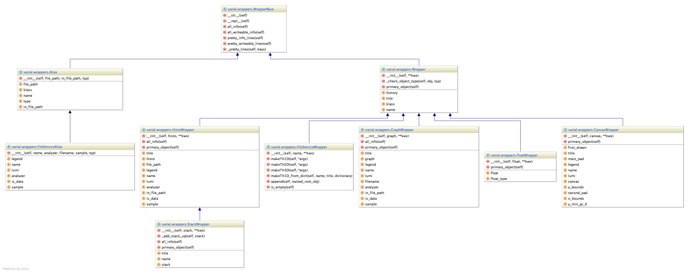

.. _wrapper-module:

===============
Module wrappers
===============

The image below shows the class diagram of the wrapper types, along with their
methods and fields (*left click -> view* for full size).

Module members
==============

.. automodule:: varial.wrappers
   :members:
   :show-inheritance:

